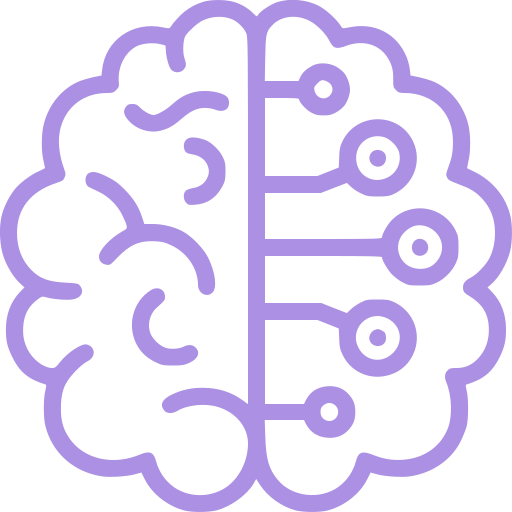

### Hi, I'm Alex Nguyen  <a href="" target="_blank">
      
## 💬 About me

- ⚡ Currently working at Bauman Moscow State Technical University
- ⚡ Currently working as 1C programmer
- 💡  Experience in Data Structures, Algorithms, Databases, SQL, AI, ML, Fuzzy Logic...
- ⚙️ Interested in System Design and Cyber Security Networking
      

<h3># CodLang</h3>

||||||
|:----:|:----:|:----:|:----:|:----:|:----:|

<h3># Knowledge</h3>

<!--  -->

| | | ||
|:----:|:----:|:----:|:----:|:----:|
|||||||

 
  

<h3>#Natural languages</h3>

||||
|:----:|:----:|:----:|

